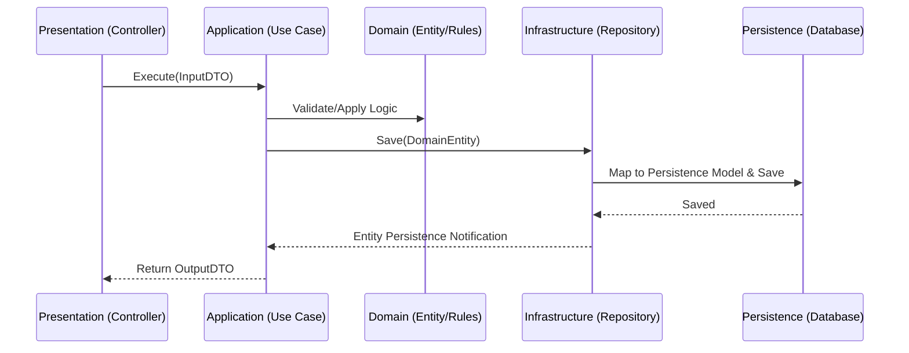

# User Management System: Clean Architecture Design Plan

This document outlines the architectural blueprint for a User Management system, adhering to the principles of Clean Architecture. The design emphasizes independence of frameworks, testability, and a clear separation of business logic from implementation details.

## 1. High-Level Architecture Overview

The system is organized into four concentric layers, with dependencies strictly pointing inward.

```mermaid
graph TD
    subgraph Presentation
        Controller[Web API Controllers]
    end
    subgraph Application
        UseCase[Use Case Interactors]
        Interface[Repository Interfaces]
    end
    subgraph Domain
        Entity[Domain Entities]
        Rule[Domain Rules]
    end
    subgraph Infrastructure
        RepoImpl[Repository Implementations]
        External[External Services]
    end

    Controller --> UseCase
    UseCase --> Entity
    UseCase --> Rule
    UseCase --> Interface
    RepoImpl ..|> Interface
    RepoImpl --> Entity
```


### Domain Layer (Core)
- **Responsibility**: Contains the highest-level business rules and entities.
- **Boundaries**: It is the center of the architecture and has no dependencies on any other layer.
- **Components**: Entities, Value Objects, and Domain Logic.

### Application Layer
- **Responsibility**: Orchestrates the flow of data to and from the domain layer. It contains system-specific business rules (Use Cases).
- **Boundaries**: Depends only on the Domain Layer. Defines interfaces for external concerns (like persistence).
- **Components**: Use Case Interactors, Service Interfaces, and Data Transfer Objects (DTOs).

### Infrastructure Layer
- **Responsibility**: Implements the interfaces defined in the Application layer. It handles communication with databases, external APIs, and file systems.
- **Boundaries**: Replaced or modified without affecting the core logic.
- **Components**: Repository implementations, external service clients, and database context.

### Presentation Layer
- **Responsibility**: Acts as the entry point for users and external systems. It translates external requests into a format the Application layer understands.
- **Boundaries**: Isolates HTTP concerns, routing, and serialization from the business logic.
- **Components**: Web API Controllers and View Models.

---

## 2. User Management Domain Design

The Domain layer defines the fundamental concepts of the User Management system.

### Core Domain Entities
- **User**: The primary entity containing attributes such as a unique identifier, full name, email address, registration date, and current status.

### Value Objects
- **User Role**: Encapsulates the logic for roles (e.g., Administrator, Standard User). Prevents invalid role assignments.
- **Account Status**: Manages the permissible states (e.g., Active, Inactive) and transitions between them.

### Domain Rules (Constraints)
- **Active / Inactive State**: A user must be Inactive upon initial registration until specific activation criteria are met. Only active users can perform standard application actions.
- **Role Conversion**: A role can only be converted to Admin by another Admin or through a specific secure elevation process.
- **Identity Uniqueness**: No two users can share the same email address within the system.

---

## 3. Use Case Planning

The Application layer implements the following system-specific business operations.

### Register User
- **Input**: User registration details (Name, Email, Password).
- **Responsibility**: Validates input format, checks for duplicate emails via the repository interface, creates a new User entity in an "Inactive" state, and persists it.
- **Output**: Success confirmation or validation error messages.

### Update User
- **Input**: Updated profile information and User ID.
- **Responsibility**: Retrieves the existing user, applies updates via the entity logic, and saves the changes.
- **Output**: The updated user summary.

### Activate / Inactivate User
- **Input**: Target User ID and desired status.
- **Responsibility**: Fetches the user, triggers the state change domain logic, and updates persistence.
- **Output**: Status update confirmation.

### Convert User Role
- **Input**: User ID and the new target role.
- **Responsibility**: Ensures the requesting user has administrative permissions and updates the target user's role.
- **Output**: Role update notification.

### Get User by Id / Get User List
- **Input**: Search criteria or a specific ID.
- **Responsibility**: Queries the repository and maps the domain entities to output DTOs.
- **Output**: Individual user details or a paginated list of users.

---

## 4. Interface Design Strategy

The Application layer defines the "shape" of the world it needs, which the Infrastructure layer provides.

### Repository Abstraction
- A generic or specific **User Repository** interface is defined in the Application layer. It includes methods for finding users by ID, searching by email, and persisting changes. This allows the core logic to remain oblivious to whether the data is stored in SQL, NoSQL, or an in-memory store.

### Dependency Injection
- Interactors (Use Cases) depend on these interfaces via constructor injection. The concrete implementation is wired up by the dependency injection container at the outermost level (Infrastructure/Presentation).

### Loose Coupling
- By using interfaces for all external dependencies (logging, email sending, data access), the Application layer is fully shielded from changes in external technologies or third-party libraries.

---

## 5. Data Flow



1. **Request**: The Presentation layer (Controller) receives a request and maps the JSON/Form body to an **Input DTO**.

2. **Execution**: The Controller passes the DTO to the relevant **Use Case Interactor** in the Application layer.
3. **Logic**: The Interactor interacts with the **Domain Layer** (Entities/Rules) and coordinates with **Infrastructure Interfaces** (Repositories).
4. **Persistence**: The Infrastructure implementation of the repository maps the Domain Entity to a **Persistence Model** (Database Entity) for storage.
5. **Response**: The result is mapped back to an **Output DTO** and returned to the Controller, which produces the final HTTP response.

---

## 6. Error Handling & Validation Strategy

### Input Validation
- Basic formatting and required-field checks occur in the **Presentation Layer** or via decorators on **Input DTOs**.

### Business Rule Validation
- Complex rules (e.g., role-based permissions, status transition logic) are handled within the **Domain Entities** or **Use Case Interactors**.

### Structured Error Response
- A unified error-handling mechanism is implemented in the Presentation layer (e.g., Global Exception Filters).
- Business violations throw custom **Domain Exceptions** (e.g., "UserNotFound", "IneligibleForAdmin") which are caught and translated into appropriate HTTP status codes (400, 404, 403) with clear descriptive messages.

---

## 7. Testing Strategy

The architecture is designed to maximize the volume of tests that can run without external dependencies.

### Unit Testing (Application & Domain)
- **Focus**: Testing Use Case Interactors and Domain logic in total isolation.
- **Mocking**: All interfaces (Repositories, External Services) are mocked using test doubles. This ensures tests are fast, deterministic, and verify logic rather than connectivity.
- **Excluded**: Framework-specific features, database drivers, and network communication are excluded from unit tests.

### Integration Testing (Infrastructure)
- **Focus**: Verifying that the concrete repository implementations correctly interact with a real or containerized database.
- **Goal**: Ensure mapping between Domain Entities and Persistence Models is accurate.

### End-to-End Testing
- **Focus**: Verifying the entire flow from an HTTP request to the database and back.
